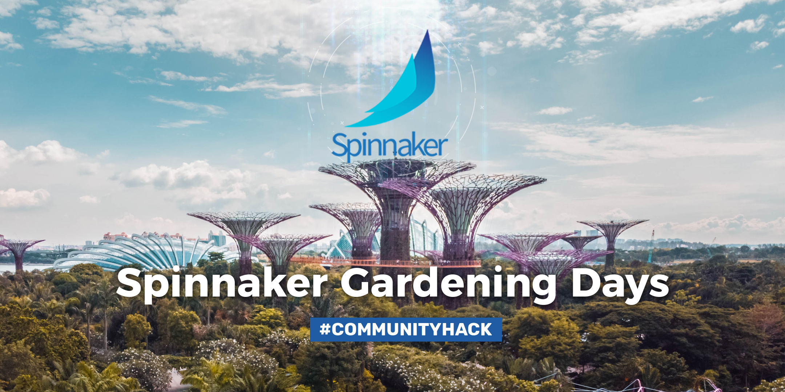

# April Spinnaker Gardening Virtual #CommunityHack

[Register here](https://www.eventbrite.com/e/spinnaker-gardening-days-communityhack-tickets-97845696111) to have fun and move the needle on continuous delivery at Spinnaker Gardening Days #communityHack, sponsored by Salesforce! Virtually join other Spinnaker users and companies on April 9 & 10 to learn and let your skills shine at this collaborative hackathon. We’ll dig into issues and features in open-source, and extend the ecosystem.

Learn more about event logistics, what we'll hack on, setting up your development environment, and more in the [Spinnaker Gardening Days](https://www.spinnaker.io/community/gardening/) pages on Spinnaker.io.

## Pre-training Videos Now Available!
1. Development environment setup training: https://youtu.be/xSZlWf9rUI4
   - Complete guide on spinnaker.io: https://www.spinnaker.io/community/gardening/dev-environment/
2. Plugins training - 
   - Backend development: https://youtu.be/b7BmMY1kR10
   - Plugins training - Frontend development: https://youtu.be/b7BmMY1kR10
   - More context is here on the Spinnaker Community Blog: https://blog.spinnaker.io/cant-go-outside-dip-your-toes-in-the-spinnaker-plugins-pool-1076f74003b
   - Build and Delivery videos will be released soon!

## Prizes, what prizes?!
Here's the prizing structure (we reserve the right to add mystery prizes to sweeten the deal!):
  - [Mavic Mini Fly More Kit](https://store.dji.com/product/mavic-mini?vid=84651), a fully-equipped lightweight camera drone
    - Enter a drawing to win by submitting a PR to a Spinnaker service or project while participating in Spinnaker Gardening
  - [Click 'N Grow Smart Garden 9](https://www.clickandgrow.com/products/the-smart-garden-9), plus seed quilts, for optimal urban or pandemic gardening
    - Win by leading a project team and recruiting team members from the community (hint: [start here](https://github.com/spinnaker-hackathon/gardening/wiki/Project-Ideas))
  - [Sphero Mini](https://www.sphero.com/sphero-mini) programmable robotic ball 
    - Brand-new contributors, win by joining a project team, participating in the demo, and creating one or more contributions (PR/issue comments and issues count!) while participating in Spinnaker Gardening
  - Win a mystery prize by participating in a project demo : )
  - Win free lunch delivery, swag, and unlimited smiles 
    - Win by showing up to Spinnaker Gardening

## What is this and why do I care?
This is quickstart documentation for the Spinnaker Gardening Days #communityHack, a series of open-source Spinnaker hackathons open to anyone in the community, including newcomers. The goal of this doc is help you get started participating.

Right now, humans are more isolated than ever; however, we're coming together virtually like never before. The culture of dispersed and asynchronous collaboration at the foundation of open source seems more relevant than ever as we must together rise to a totally overwhelming and frightening global challenge. Spinnaker Gardening Days aims to shine a light of fun and hope into our community. We envision a future of great software delivery bringing us closer to the experiences that matter. 

Let's solve together; you'll have fun, we promise!

## When is the event?
The first event will take place online on April 9 & 10, 2020. [Click here](https://www.eventbrite.com/e/spinnaker-gardening-days-communityhack-tickets-97845696111) to register. Tickets are available for the hackathon. 

## How should I prepare to participate in Spinnaker Gardening?
1. Register for the event [on Eventbrite](https://www.eventbrite.com/e/spinnaker-gardening-days-communityhack-tickets-97845696111)
2. [Join Spinnaker Slack](https://join.spinnaker.io) and join the following channels:
    * **[#gardening-general](https://spinnakerteam.slack.com/archives/CV4A90DPF)**   Make general, public conversation. Please use threads for (welcome!) jokes and side conversations.
    * **[#gardening-ineedhelp](https://spinnakerteam.slack.com/archives/CURFZGL2E)**   Request help from experts during the hackathon, or ask setup questions before it starts.
3. Ask your organization to support you in spending time at the event. [Use this flyer](https://s.armory.io/v1ur0KQQ) to highlight the benefits of participating (TL;DR - expert tips, network with fellow Spinnaker devs, free training, exposure for your company).
4. Visit the [Project Ideas Wiki](https://github.com/spinnaker-hackathon/gardening/wiki/Project-Ideas) in the Gardening Wiki tab. 
   * Review the ideas. If you have follow-up ideas, questions, or enthusiasm for an idea, join the listed __#gardening-idea-XXXXXX__ channel in Slack to discuss it.
   * If you have a project idea, follow the instructions to add it. Then, go to Spinnaker Slack and create the Channel Name you specified. 
5. Read the [Plugin Users Guide](https://www.spinnaker.io/guides/user/plugin-users/) to learn about the new plugin framework for Spinnaker. Project teams should strongly consider building extensions and customizations as plugins, to accelerate progress and make projects easier to maintain. Leverage an existing Gradle build and extension points in Spinnaker's microservices. Look out for more in-depth plugin training soon!
6. Leverage our ramp-up materials. We will announce in **#gardening-general** and publish the links on this page when they are available. The Workshops will be ready the week prior to the hackathon. We'll also host office hours on the day before the hackathon starts; you can ask for help there or in Slack.

    - Asynchronous Getting Started Workshop
    - Asynchronous Plugins Workshop
    - April 8, 4:00-8:00 PM PST - Open Office Hours @ Armory

## What activities can I expect to find at the April event?
Teams will meet to work on Spinnaker projects during work blocks, and for as much time as desired between the 4/9 Kickoff and 4/10 Show & Tell sessions.

New to Spinnaker? This event offers other opportunities to join the community. A Spinnaker training track will offer sessions during this time, as an alternative. Lunchtime speaker panels will offer Spinnaker and software delivery wisdom. The Docs SIG will host an activity channel for building Spinnaker.io resources. If you want to host an activity, speak up in __#gardening-general__. 

### Hackathon Schedule
*Hint: The times listed are for the Pacific Time Zone (GMT -7). You're not limited to those hours though! Also try passing work to teammates in a different time zone at the end of your workday so that they can move the project forward during their daytime hours*

__Look out for optional break channel events to be added to this schedule, or propose your own in #gardening-general!__

#### Day One
|Time PST|Activity|
|-----|-----------------------|
|8:30-8:40 AM|Welcome & Orientation|
|8:40-8:50 AM|Kickoff Remarks|
|8:50-9:10|Project Matchmaking|
|9:10-12:15|Team Work Block|
|12:30-1:30 PM|Lunch Panel (optional)|
|1:30-2:30 PM|Expert Check-Ins|
|2:30-4:00 PM|Team Work Block|
|4:00-4:15 PM|Breaktime Fun (optional)|
|4:15-EOD|Team Work Block|
|5:00-6:30 PM|Garden Party Happy Hour|

#### Day Two
|Time PST|Activity|
|-----|-----------------------|
|7:00-7:05|Welcome|
|7:05-10:00 AM|Team Work Block|
|9:00-10:00|Expert Check-Ins|
|10:00-10:15|Breaktime Fun (optional)|
|10:15-12:30|Team Work Block|
|12:30-1:30 PM|Lunch Panel (optional)|
|1:30-3:00 PM|Team Work Block|
|3:00-5:00|Show & Tell Demos
|5:00-5:20|Community Awards|
|5:20-5:30|Wrap-Up|

### Training Schedule
#### Morning Modules: Get Hands-On With Spinnaker
_Attend these modules either Thursday or Friday morning_
|Time PST|Module|
|-----|-----------------------|
|9:00-9:50|SDLC Concepts|
|10:00-11:00|Intro to Spinnaker Lab 1: First Pipeline for Kubernetes|
|11:00-11:50|Intro to Spinnaker Lab 2: AWS QuickStart|
|12:00-12:30|Spinnaker Concepts|

#### Thursday PM Modules: Advanced Spinnaker
|Time PST|Module|
|-----|-----------------------|
|1:30-2:00|Intro to Operating Spinnaker|
|2:00-2:50|Advanced Spinnaker Lab 1: SpEL & Artifacts|
|3:00-4:00|Advanced Spinnaker Lab 2: Custom Stages|
|4:10-5:00|Spinnaker Plugins|

#### Friday PM Modules: By Popular Demand
|Time PST|Module|
|-----|-----------------------|
|1:30-2:00|Open Floor Q&A|
|2:00-3:00|Repeat Session or Q&A by Slack Vote|

## How will we form project teams?
Project teams should have no more than *5 participants*. 3 can be an ideal number for hackathon project teams. We'll form teams in Slack, using the channels you generate from the [Project Ideas Wiki](https://github.com/spinnaker-hackathon/gardening/wiki/Project-Ideas). 

If you post an idea, you have a choice: 
  * you can act as the team lead
  * you can find and nominate a team lead for your project
  
The team lead must:
  * Create a new repository inside the [`spinnaker-hacakthon`](https://github.com/organizations/spinnaker-hackathon) organization. Use the string from your Slack channel name ("#gardening-idea-__XXXXXXX__") for your repository name to make it easy for other participants to find the project. 
  * Ensure that a descriptive README file anchors the project. This is your project proposal and will help the community to understand your amazing concept and implementation ideas.

If you're interested in a posted idea or repository in `spinnaker-hackathon`, visit the channel to find out if a team is forming. If you need to recruit teammates, try posting in __#gardening-general__ about the skills you're looking for. 

Event admins will reach out to proposed Team Leads the week before the event to verify participation and begin creating #gardening-team-XXXXXXX channels for use during the hackathon.

Project teams are not rigid. You are free to participate in the way that makes most sense to you; please respect your teammates and communicate.

## How will we propose project ideas to potential teammates?
To maximize our hack time, you can begin pitching projects and forming teams in advance of April 9. First, ideas should be shared in Slack and recorded in the [Project Ideas Wiki](https://github.com/spinnaker-hackathon/gardening/wiki/Project-Ideas). 
Once you've committed to an idea and created a repository for it, use the repo's README file to propose your project. Images and YouTube videos are welcome aids for explaining your idea. Use __#gardening-general__ posts, Twitter, or any other means you like to recruit teammate(s).

After the Kickoff on April 9, we'll do a short Project Matchmaking session. This will allow any newcomers looking to join teams or review the project READMEs and ask questions. Any project teams still looking for members should speak up during this time to recruit.

## How will you select a winning team?
This is a collaborative hackathon, so there won't be one winning team. However, community awards and **prizes will be given to all teams that present at the Demo**. After the hackathon ends, a community voting period will happen in Spinnaker Slack to select the **Community's Choice Project**. The Community Choice Project will get recognized at Spinnaker Summit in October. 

## Do I need to build something production-ready to participate?
NO! A top goal of this event: build the community and give participants a chance to get to know each other. Your team isn't required to build something that’s fully working. If you get halfway through a project and it no longer makes sense, you will have likely learned a lot and made connections. Stay and hang out! While we're sure to come out with some useful features, fixes, or plugins, this is supposed to be fun. It does not need to be feature complete.

## Should we build our project as a Spinnaker plugin?
Yes, if possible! Read the [Plugin Users Guide](https://www.spinnaker.io/guides/user/plugin-users/) to learn more about how to use and build Spinnaker plugins.
