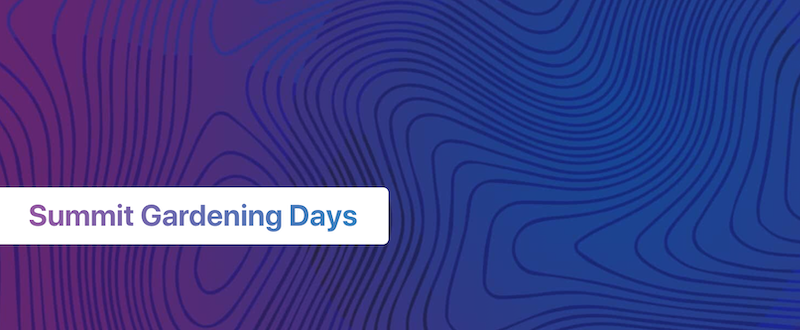

# Gardening Days is coming to Spinnaker Summit 2020

[Register here](https://events.linuxfoundation.org/spinnaker-summit/register/) to join project contributors October 19 - November 12 to learn and build at Spinnaker Summit. 

### [Register](https://events.linuxfoundation.org/spinnaker-summit/register/)
### [Getting Started](getting-started.md)
### [Schedule](schedule.md)
### [Projects, Ideas, and Teams](project-ideas.md)
### [Judging and Points Eligibility & Tracking](points.md)
### [Challenges](challenges.md)
### [Prizes](prizes.md)
### [Development Environments](development-environments.md)
### [Training](training.md)
### [Volunteering - Get involved!](expert-volunteers.md)

All contributions you make in the 4-week hack period, including project and plugin code, documentation, content, videos, issues [and more](https://spinnaker.io/community/gardening/what-to-hack/), add up to points. All contributors will receive prizes based on their point totals, so contribute when you can. When you [sign up](https://events.linuxfoundation.org/spinnaker-summit/register/), you'll enter the team matching process. Teams can choose to compete in [challenges](challenges.md) set by Armory, GitHub, AWS, and more. All teams that demo a project will be eligible for prize packages awarded to challenge-winning teams and runners-up in each challenge. 

Elevate your impact with free compute from AWS, SIG projects, a global-friendly schedule, first-class documentation and training resources, and a friendly team of advocates and volunteers to greet and assist you. Everyone's welcome to automate the SDLC and extend the ecosystem with us!

Learn more about event logistics, what we'll hack on, setting up your development environment, and more in the [Spinnaker Gardening Days](https://www.spinnaker.io/community/gardening/) pages on Spinnaker.io. Got questions that aren't answered here? Post in [#gardening-general](https://spinnakerteam.slack.com/archives/CV4A90DPF) on Spinnaker Slack.

-------------------------

## How to participate and earn prizes

Contribute when you can! When you [register](https://events.linuxfoundation.org/spinnaker-summit/register/), you'll be matched with a team. If you have registered, you will receive your team match via [Spinnaker Slack](http://join.spinnaker.io) by October 15. If you need assistance with registration, team matching, or planning your participation, you may inquire in the [#gardening-general](https://spinnakerteam.slack.com/archives/CV4A90DPF) channel. 

Time to double-dip: All contributions you make in a team project count as individual contributions, and demoing a project enters your team to win a challenge prize package, too! Your individual contribution points will be tracked on the [contribution tracking sheet](https://go.armory.io/contributors). Read more in the [Hackathon logistics](https://www.spinnaker.io/community/gardening/hack-logistics/) page.

Here's the eligibility breakdown for our two buckets of prizes:

- **Individual Prizes:** When you [register](https://go.armory.io/gardening), all contributions you make during the Gardening Days (October 19 - November 12) count towards your [contributor points total](https://go.armory.io/contributors). Earn points = Earn prizes. [Check out the full list of qualified contributions](https://spinnaker.io/community/gardening/what-to-hack/), including:
  - GitHub activity and contributions
  - Spinnaker tips or recent news items shared in OSS Slack
  - Codelab and training video run-throughs
  - Assisting in Spinnaker Slack answers
  - Assisting in Spinnaker [StackOverflow](https://stackoverflow.com/questions/tagged/spinnaker) answers
  - Documentation activities
  - Filling out our deployment survey at go.armory.io/deployment-survey (you will also receive a charitable donation of your choice in your name)
  
 - **Team Prize Packages:** Winning teams will be awarded divisible prize packages. Read more on the [Prizes page](prizes.md).
 
 _Note that the [contribution tracking sheet](https://go.armory.io/contributors) cannot track GitHub event contributions in real time because of the way the data is collected from GitHub APIs, and will reflect a lag of at least 24 hours. Other contributions are manually tracked via Slack and thus will also lag. Final point tallies will be announced after event conclusion in Slack and via the [Community Blog](https://blog.spinnaker.io/)._
 
## Frequently Asked Questions

### When is the event?
The third Spinnaker Gardening Days will take place online October 19th - November 12th, 2020. [Click here](https://go.armory.io/gardening) to register. Tickets are available for the hackathon and dedicated training workshops. The third Spinnaker Gardening Days will take place ahead of [Spinnaker Summit](https://www.spinnakersummit.com/), scheduled for the end of October.

### Is this suitable for first-timers? How will team formation work?
Gardening Days organizers will help each participant who wants to join a team find one on which they can stay productive and engaged. Registration questions will help us get to know you, and if hackathon organizers have questions about or want to follow up, we'll reach out to you on [Spinnaker Slack](http://join.spinnaker.io). 

The week before the hackathon, we'll begin connecting  balanced starter teams of 2-5 on [Spinnaker Slack](http://join.spinnaker.io). There, you can get acquainted and share your project ideas. Our team of Spinnaker community experts can also help you choose a challenge and project, and will be available to assist you in ofice hours and on-call shifts throughout the month to consult and collaborate through blockers. 

Team membership is flexible, and participants are permitted to migrate teams, join multiple teams, or create their own teams. Attendees are encouraged to reach out to organizers early and often (direct message @dnilasor or post in [#gardening-general](https://spinnakerteam.slack.com/archives/CV4A90DPF)) for assistance with team matching or if concerns or team-fit issues arise. 

### How will you select a winning team?
For sponsored challenges, sponsors have the option to select a winning team(s). For those that don't choose that option and community challenges, a poll of Spinnaker and OSS expert volunteers from different companies will determine the winners. Additional community awards may also be recognized.

### Do I need to build something production-ready to participate?
NO! A top goal of this event: build the community and give participants a chance to get to know each other. Your team isn't required to build something that’s fully working. If you get halfway through a project and it no longer makes sense, you will have likely learned a lot and made connections. Stay and hang out! While we're sure to come out with some useful features, fixes, or plugins, this is supposed to be fun. It does not need to be feature complete.

### Should we build our project as a Spinnaker plugin?
Yes, if it makes sense! Read the [Plugin Users Guide](https://www.spinnaker.io/guides/user/plugin-users/) to learn more about how to use and build Spinnaker plugins. Folks in the [#sig-platforms](https://spinnakerteam.slack.com/archives/CPHARS3RA) channel and the @on-call-gardener can advise on which projects will work as plugins. More context is also available [here on the Spinnaker Community Blog](https://blog.spinnaker.io/spinnakers-extensibility-reaches-new-heights-with-plugins-645fd73f8d6a).

### What is this and why do I care?
This is quickstart documentation for the Spinnaker Gardening Days, a series of open-source Spinnaker hackathons open to anyone in the community, including newcomers. The third and latest Gardening Days will be held at our virtual Spinnaker Summit 10/10-11/12. The goal of this doc is help you get started participating.

Right now, humans are more isolated than ever; however, we're coming together virtually like never before. The culture of dispersed collaboration at the foundation of open source seems more relevant than ever, as we must together rise to totally overwhelming and frightening global challenges. Spinnaker Gardening Days aims to shine a light of fun and hope into our community. We envision a future of great software delivery bringing us closer to the experiences that matter. 

Let's solve together; you'll have fun, we promise!
