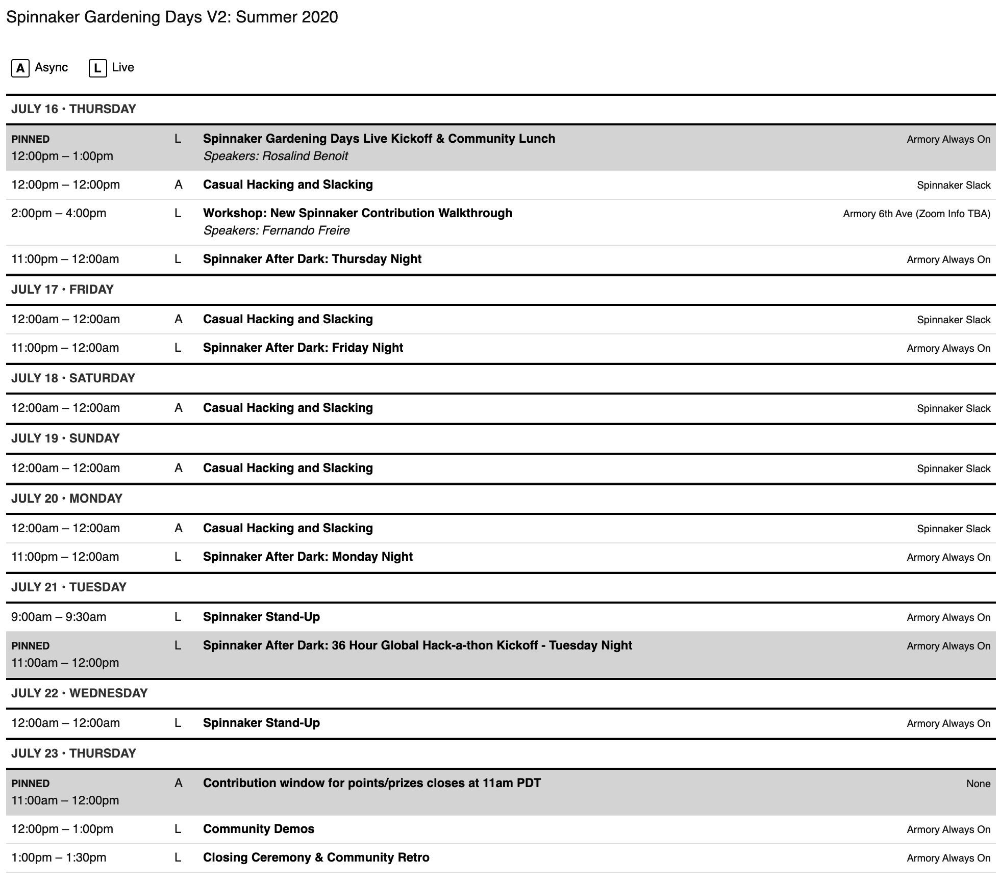

# Spinnaker Gardening Days, our open source hackathon

[Register here](https://go.armory.io/gardening) to join Spinnaker contributors on July 16-23 to learn and build. All contributions you make in the week, including project and plugin code, documentation, content, videos, issues [and more](https://spinnaker.io/community/gardening/what-to-hack/), add up to points. All contributors will receive prizes based on their point totals, so contribute when you can. When you [sign up](https://go.armory.io/gardening), you'll be matched with a team. Teams can choose a project and compete in one of [four challenge categories](https://spinnaker.io/community/gardening/hack-logistics/#team-challenges). Teams that demo a project will be eligible for prize packages awarded to challenge-winning teams and runners-up in each category. 

Elevate your impact with free compute from AWS, SIG projects in Security, Ops, and more, a global-friendly schedule, and updated documentation and training resources. Everyone's welcome to automate the SDLC and extend the ecosystem with us!

Learn more about event logistics, what we'll hack on, setting up your development environment, and more in the [Spinnaker Gardening Days](https://www.spinnaker.io/community/gardening/) pages on Spinnaker.io. Got questions that aren't answered here? Post in [#gardening-general](https://spinnakerteam.slack.com/archives/CV4A90DPF) on Spinnaker Slack. 

## I missed the event kickoff. What happened? Is there a video?

Sad news first: no video, as we had some technical difficulties with our kickoff Zoom call. [Watch the recap we recorded](https://youtu.be/k4-rBm3LZAo), and here's a summary of what we discussed:
- [Spinnaker Slack](https://join.spinnaker.io) and GitHub accounts are required for full participation in Gardening Days.
- To check in to Spinnaker Gardening Days and have your GitHub handle added to the [Contribution Tracking doc](https://go.armory.io/contributors) and this organization, please use the link https://go.armory.io/gardening-checkin. When you check in, you will also provide the address to which we should send your swag and prize(s).
- Big thank you to our compute sponsor, AWS! Thanks to AWS, we are able to provide free compute for hackathon participants in a managed environment. You can [read more about training and development environments](README.md#training-and-development-environments) below.
- Spinnaker Gardening Days is a hackathon where attendees are forming teams to work on Spinnaker projects of their choice, and/or making individual contributions to the project.
  - Team projects with output to demo will be judged by our team of experts (on-call gardeners and match advisors), and winners will be chosen in each [challenge category](README.md#team-challenges).
    - Teams and challenges are not set in stone, and it is OK for participants to form new teams, propose projects, and engage with multiple teams to find the right fit. Just be courteous.
    - Two of our SIGs are sponsoring teams: 
      - Ops SIG is working on dynamic accounts automation. Visit #sig-ops to get involved!
      - Security SIG is working on threat models. You don't need to be a security expert to add value. Visit #sig-security to get involved!
  - Individual contributions include but are not limited to [the ideas on this list](https://spinnaker.io/community/gardening/what-to-hack/). Each contribution is worth one point, and attendees will earn prizes by reaching different [points thresholds](README.md#prizes). __Contributions that are GitHub events will be counted with no additional action from you__ and should appear on the [tracking doc](go.armory.io/contributors) once the batch is processed. When you make other contributions, such as community content (videos, blog posts, Twitch streams) and StackOverflow posts, you will need to post your evidence/link(s) into #gardening-general to receive credit. If non-code contributions were a team effort, tag all participants in the post so that everyone receives points. 
  - A few tips on content contributions:
    - If you are making __video content__, playlists of shorter videos will earn you more points than single long videos. These are easier for viewers to consume.
    - To write a __blog post__ with the intent of posting it on the [Spinnaker Community Blog](https://blog.spinnaker.io/), it will be easiest to write it as a Medium post. Event organizers can get your approved blog posts added to the community blog. You are also free to post on your personal or company blog. Ping in #gardening-general if you need assistance duplicating an external blog post on the community blog.
    - There is a ton of cool new content in the [videos from Spinnaker.Live](https://www.youtube.com/playlist?list=PL4yLrwUObNkvO80Bjln8_DJXxQNSYrtEs). Watch them, and better yet, write a tech blog about one of the presentations, or an article based on one of the keynotes, enterprise use cases, or panels.
    - The types of content and contributions you can make are not limited to organizer imaginations. If there is something you'd like to contribute and it hasn't been mentioned, please share in #gardening-general to discuss eligibility.
  - A few ideas for GitHub event contributions:
    - One cool proposed idea is [adding Kayenta support for CloudWatch](https://github.com/spinnaker/spinnaker/issues/5888).
    - Join #sig-documentation to help with some exciting projects happening around [spinnaker.io](https://www.spinnaker.io). Ask the SIG how you can help with the Spinnaker refresh project! One great contribution would be to help writing high-quality short descriptions for pages on the site, since our new static generator Hugo defaults to the first 70 characters on the page and that doesn't always provide a good description.
    - Don't forget to check the list of [beginner friendly issues](https://github.com/spinnaker/spinnaker/issues?q=is%3Aopen+is%3Aissue+label%3A%22beginner+friendly%22) for issues you're interested in. These are a great way to get started!
  - Check out the [prize details](README.md#prizes).
- Participants can get one point for filling out the [deployment survey](https://go.armory.io/deployment-survey). Armory will also make a charitable donation on your behalf to the charity of your choice when you complete it. The survey is anonymous and does not collect any personal data. The questions were developed by AWS and Armory to get more information about how we can improve experiences in using Spinnaker and integrating it with our products.
   
## Attending Events during Gardening Days
- Stay tuned for upates to the [schedule](https://spinnaker.io/community/gardening/schedule/) of events.
- Main Zoom link for the event will be released to ticket holders prior to our live events. [Register](https://go.armory.io/gardening) for access.
- All other Zoom meeting links for the event will be available as channel topics in [event Slack channels](https://www.spinnaker.io/community/gardening/slack-map/)
- [What to hack](https://www.spinnaker.io/community/gardening/what-to-hack/) and [Hackathon logistics](https://www.spinnaker.io/community/gardening/hack-logistics/) guidance available on spinnaker.io

## Training and Development Environments

We'll offer two sessions of the New Spin Contribution Walkthrough Workshop at the July event. This will provide a managed sandbox environment in AWS EKS, thanks to our compute sponsor, Amazon. Each participant is assigned their own namespace in the cluster, with access to that namespace only. Participants will install Spinnaker there, and then use Telepresence to set up a local development environment for Spinnaker services that is connected to the remote K8S cluster. With that set up, participants will walk through making code changes to Spinnaker services Orca and Deck, using the creation of a new stage as an example.

After the workshops, we will share a recording of the walkthrough with Gardening attendees so that everyone can use the training asynchronously. Attendees can also access the EKS cluster and use the development environment! Just @ mention @Fernando Freire in #gardening-general to request a namespace, and we'll create one for you to develop in.

We're also offering a Plugin Development Workshop. Participants will need to have Spinnaker running in Kubernetes to follow along. The New Spin Workshop environment fulfills this requirement with the sandbox environment, but another Spinnaker environment in K8S will work, too.

## How to participate and earn prizes

Contribute when you can! When you register, you'll be matched with a team. You will receive your team match via [Spinnaker Slack](join.spinnaker.io) by July 15. All contributions you make in a team project count as individual contributions, and demoing a project enters your team to win a challenge prize package, too!  

Here's the eligibility breakdown for our two buckets of prizes:

- **Individual Prizes:** When you [register](https://go.armory.io/gardening), all contributions you make during the Gardening Days (July 16-23) count towards your contributor points total. Earn points = Earn prizes. [Check out the full list of qualified contributions](https://spinnaker.io/community/gardening/what-to-hack/), including:
  - GitHub activity and contributions
  - Spinnaker tips or recent news items shared in OSS Slack
  - Codelab and training video run-throughs
  - Assisting in Spinnaker Slack answers
  - Assisting in Spinnaker StackOverflow answers
  - Documentation activities
  - Filling out our deployment survey at go.armory.io/deployment-survey (you will also receive a charitable donation of your choice in your name)
  
 - **Team Prize Packages:** Teams in each challenge category will be awarded divisible First and Runner Up team prize packages. Read more below.
 
## Team Challenges: 

Gardening Days challenges allow your hackathon project to compete in the category where your team will create the most impact.
- **Fix Bugs & Error Messages** _Retrofit 500 Challenge_ - Fix the most commonly occurring 500 errors
- **Extend Spinnaker** _Plugin Challenge_ - Work with Armory engineers to customize Spinnaker with a plugin
- **Share Content** _Automate Your SDLC Challenge_ - Share your Spinnaker with technical content
- **Join a SIG Project** _SIG Challenges_ - Everyone's welcome! Join a SIG team by showing up at a Special Session SIG meeting:
  - Documentation SIG - **Wednesday July 15, 10:30 AM PDT** - Share docs feedback and develop content for Spinnaker.io
  - Security SIG - **Thursday July 16, 11 AM PDT** - Discuss and develop threat models for Spinnaker deployment endpoints
  - Ops SIG - **Thursday July 16, 10 AM PDT** - Build a Spinnaker customization to automate dynamic accounts configuration
  
## Prizes!:

Drumroll please...

### Individual Prize Tiers
Here's what you'll get to play with if your points total crosses these thresholds. You'll earn one point every time you complete an item on [this list](https://spinnaker.io/community/gardening/what-to-hack/). Points will be [tracked here](https://docs.google.com/spreadsheets/d/1kt9MJexQTPb1AuC5mQXZBX-NBZf5XsSwBBpy3WJ_fJk/edit?usp=sharing) on the Spinnaker Gardening Days Contributors tab and updated in batches throughout the week. We'll ship your prizes along with your Gardening tshirt. Be patient; shipping is bananaballs right now!

#### Hacker = 15 points
Earn a [Raspberry Pi Zero W](https://www.raspberrypi.org/products/raspberry-pi-zero-w/) for all your projects.  The on-board wireless is a game changer!

#### Hedgehog Hacker = 30 points
Earn a [Raspberry Pi Zero W](https://www.raspberrypi.org/products/raspberry-pi-zero-w/) AND a [crystal-growing hedgehog](https://youtu.be/W2rK8KdrDkY). Just, because.

#### Toy Hacker = 50 points
Earn a [Sphero Mini](https://sphero.com/products/sphero-mini) programmable ball, back by popular demand from kiddos of participants in the last Gardening Days!

#### Robot Hacker = 70 points
Earn a [Cozmo](https://anki.com/en-us/cozmo.html), the Twitchable robot. Includes an implicit contract that you will use it to make Spinnaker cuter on social media. Kidding...kinda.

#### Switch Hacker = 100 points
Earn a [Nintendo Switch Lite](https://www.nintendo.com/switch/lite/), coveted COVID gaming companion, to unlock portable multiplayer fun.

### Team Prize Packages
In addition to the individual prizes, we will reward active members of winning and runner-up teams with Amazon gift cards. 
- First prize = Team receives $150, divided among teammates
- Runner-up = Team receives $100, divided among teammates

  
## What is this and why do I care?
This is quickstart documentation for the Spinnaker Gardening Days #communityHack, a series of open-source Spinnaker hackathons open to anyone in the community, including newcomers. The goal of this doc is help you get started participating.

Right now, humans are more isolated than ever; however, we're coming together virtually like never before. The culture of dispersed and asynchronous collaboration at the foundation of open source seems more relevant than ever as we must together rise to a totally overwhelming and frightening global challenge. Spinnaker Gardening Days aims to shine a light of fun and hope into our community. We envision a future of great software delivery bringing us closer to the experiences that matter. 

Let's solve together; you'll have fun, we promise!

## When is the event?
This second event will take place online on July 16th - 23rd, 2020. [Click here](https://go.armory.io/gardening) to register. Tickets are available for the hackathon and dedicated training workshops. 

## Teams and First Timers
This time, team formation is on us. The registration questions will help us to create balanced teams of 2-5. Then, we'll connect you with your teammates on Spinnaker Slack the week on the hackathon. There, you can share your project ideas. Our team of Spinnaker community experts can also help you choose the perfect project, and will be on call to advise you through the week. Consult and collaborate through blockers.

## How should I prepare to participate in Spinnaker Gardening?
1. [Register for the event](https://go.armory.io/gardening)
2. [Join Spinnaker Slack](https://join.spinnaker.io) and join the following channels:
    * **[#gardening-general](https://spinnakerteam.slack.com/archives/CV4A90DPF)**   Ask any questions you have here! Make general, public conversation. Please use threads for (welcome!) jokes and side conversations.
    * **[#gardening-ineedhelp](https://spinnakerteam.slack.com/archives/CURFZGL2E)**   Request help from experts during the hackathon, or ask setup questions before it starts.
3. Watch Spinnaker Slack July 14-15 for your Team Match message.
4. Begin setting up your development environment.

## Pre-training Videos
1. Development environment setup training: https://youtu.be/xSZlWf9rUI4
   - Complete guide on spinnaker.io: https://www.spinnaker.io/community/gardening/dev-environment/
2. Plugins training
   - [Pluging into the UI video](https://youtu.be/u9NVlG58NYo)
   - [Pluging into Spinnaker services video](https://youtu.be/b7BmMY1kR10)
   - [Plugin build and release video](https://drive.google.com/file/d/16DIo812nRyan2CDCTuZvsgN4D9yl0Dur/view?usp=sharing)
   - [Plugin delivery video](https://drive.google.com/file/d/1k-MUgmwWFdh6YiozmFw5Y2hGSm84UeTw/view?usp=sharing)
   - More context is here on the [Spinnaker Community Blog](https://blog.spinnaker.io/cant-go-outside-dip-your-toes-in-the-spinnaker-plugins-pool-1076f74003b)

## Hackathon Schedule (Tentative)
<a id="sched-embed" href="//sgdays.sched.com/">View the Spinnaker Gardening Days V2: Summer 2020 schedule &amp; directory.</a>

## How will you select a winning team?
This is a collaborative hackathon, so there won't be one winning team. However, community awards and **prizes will be given to all teams that present at the Demo**. After the hackathon ends, a community voting period will happen in Spinnaker Slack to select the **Community's Choice Project**. The Community Choice Project will get recognized at Spinnaker Summit in October. 

## Do I need to build something production-ready to participate?
NO! A top goal of this event: build the community and give participants a chance to get to know each other. Your team isn't required to build something that’s fully working. If you get halfway through a project and it no longer makes sense, you will have likely learned a lot and made connections. Stay and hang out! While we're sure to come out with some useful features, fixes, or plugins, this is supposed to be fun. It does not need to be feature complete.

## Should we build our project as a Spinnaker plugin?
Yes, if possible! Read the [Plugin Users Guide](https://www.spinnaker.io/guides/user/plugin-users/) to learn more about how to use and build Spinnaker plugins.

## How can I get involved in Spinnaker Gardening Days as a Spinnaker Expert? What kind of support will experts provide to attendees?
So glad you asked! Here are the volunteer role descriptions for Spinnaker Gardening Days Experts. If you would like to volunteer for one of these roles, please post in [#gardening-general](https://spinnakerteam.slack.com/archives/CV4A90DPF) on Spinnaker Slack. 

### On-Call Gardener (est 3.5 hrs per shift)
The On-Call Gardener volunteers to monitor Slack channels during the gardening event and answer questions from participants. When starting their rotation, the On-Call Gardener will add themselves to the @on-call-gardener Slack Team so that participants can ping a convenient handle with questions. When they're done, they'll leave the team so they don't get pinged unnecessarily.

#### On-Call Gardener Tips
- If you don't know the answer to a question, pull in a fellow Expert that may know. Failing that, point attendees to the appropriate SIG
- Be courteous to the participants! This is often their first experience to the community, and we want to make sure they come back :)
- Check-in to the [#gardening-general](https://spinnakerteam.slack.com/archives/CV4A90DPF) and [#gardening-ineedhelp](https://spinnakerteam.slack.com/archives/CURFZGL2E) channels ocassionally with a friendly message, so that participants have a face to attach to the questions they ask!

### Team Mentor (est 1 hr per weekday)
A mentor gardener volunteers to guide a hackathon team in its project from decision to demo. Mentor gardeners will receive team assignments on June 14. They should reach out via the team channels in Spinnaker Slack to inquire about project ideas and offer to assist with project selection. After that, at minimum, a mentor gardener should check in with the mentee team every weekday via Slack, June 16-17 and 20-23. Zoom meetings are also an option, and we recommend that mentors spend a hour with their teams each weekday.

#### Team Mentor Tips
- Set expectations about communication methods and cadence with the team on or before kickoff day (the 16th) and plan some check-ins
- As a mentor gardener, you’re not expected to know everything. You ARE strongly encouraged to familiarize yourself with those that have Spinnaker expertise, and introduce your team to other experts who can assist when you cannot unblock

### Hands-On Teacher (est 6 hrs)
A hands-on teacher volunteers to guide a group of attendees in a hands-on training that is developer and contributor-focused. Spinnaker Gardening Days Hands-On Classes aim to get newer Spinnaker contributors comfortable in building Spinnaker and Spinnaker plugins. Teachers will prepare or curate content for a session 90 that provides hands-on practice, and deliver that session during Gardening Days. Teachers may need to prepare an environment for students to work through the course content within. Teachers should expect to provide support to students during the class, and on a limited basis after the class during the hackathon. Teachers should be OK with the class being recorded and shared. Asynchronous classes with no support are also possible at Spinnaker Gardening Days, so reach out in [#gardening-general](https://spinnakerteam.slack.com/archives/CV4A90DPF) if you'd like to offer one.

### Hands-On Teaching Assistant (est 2.5 hrs)
A hands-on teaching assistant volunteers to support hands-on teachers and attendees during a Spinnaker Gardening Days Hands-On Class. This may include going into breakout rooms with one or more attendees to troubleshoot 1:1 or in smaller groups. Hands-on TAs should be generally familiar with the course material and should reach out to the teacher in advance to sync on content. 

### Match Advisor (est 2.5 hrs)
A match advisor is responsible for assisting in the formation of teams from hackathon teams based on the skills and interests they share at registration. Match advisors must be available for a half hour orientation discussion the week of July 6th, and for a 2-hour synchronous session on Monday afternoon (7/13) or Tuesday morning (7/14) to form the teams.

## To Be Announced:
Look out for a **training schedule** and **training playlists**, a **team and project matching timeline**, a **prize package breakdown**, and more.
